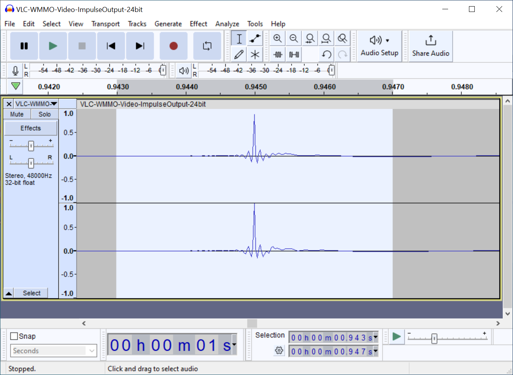
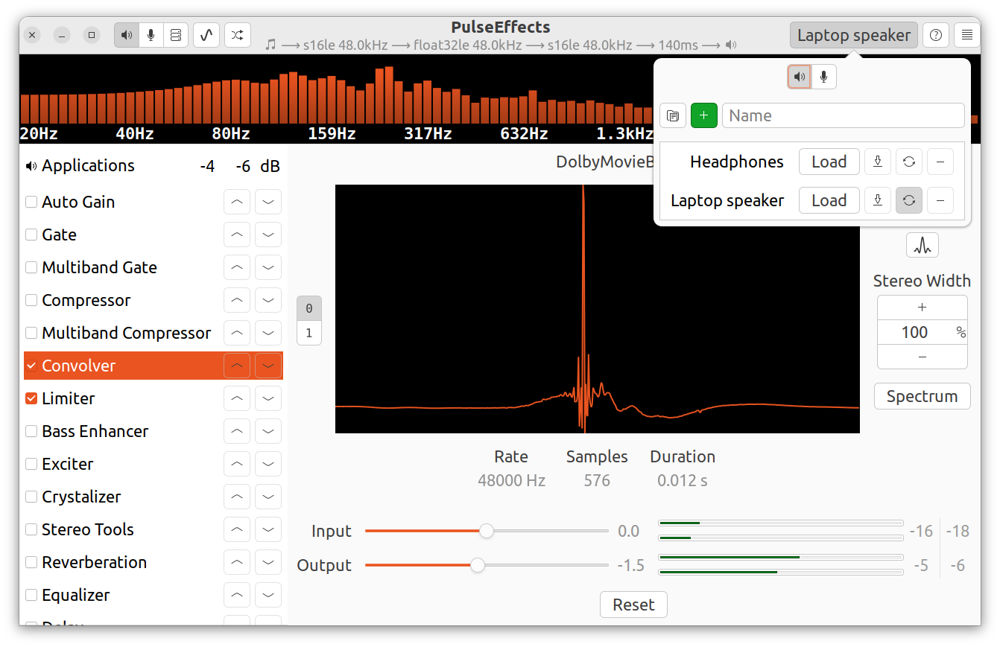

# Linux + Thinkpad speaker improvements

Thinkpads ship by default with Windows, which comes with Dolby Atmos software that improves the sound quality coming from the speakers significantly. This is very noticeable if you turn the Dolby effects on and off while playing music. This software is not available under Linux, which means the sound quality is roughly the same as what you hear with the Dolby effects turned off. The resulting quality can be pretty bad. For example, at high volumes, I can hear significant chassis resonance for certain laptop models while playing music.

The good news is that there is a way to improve the speaker sound quality. It seems like the Dolby software is doing at least two things to improve speaker quality:

1. It applies a convolution on the actual sound directly in the operating system.
2. It might also be interacting with the speakers differently than Linux.

The first item is something we can emulate on Linux while the second item is not. Thus the bad news is the sound quality from Windows + Dolby will always be better than Linux, until someone can reverse engineer with Dolby is doing to the speakers post convolution. This guide shows you how to apply the same convolution that Dolby is applying in Linux.

## Obtaining the impulse response profile (.irs) files from Windows

We need to figure out how the filtering is done with Dolby. To do this, we can simply play an impulse audio file, and measure the output audio, which is the impulse response and we can use it in a convolution filter. Step by step:

1. Install `Audacity` and `VLC` on Windows. If you don't have Windows, you can
   try installing [Windows to go](https://www.pcmag.com/how-to/how-to-run-windows-10-from-a-usb-drive).
2. Enable all Dolby effects using the Dolby app (`Dolby Audio Premium` at the time of writing this). Convince yourself that it is working by playing some music and turning the Dolby effects on and off.
3. Open `Audacity`, select `Edit` -> `Preferences` and then select the `Audio Settings` on the left tree.
4. Under `Interface` -> `Host`, select `Windows WASAPI`
5. Under `Playback` -> `Device`, select the speakers (`Speaker (Realtek(R) Audio)` for me).
6. Under `Recording` -> `Device`, select the speakers loopback (`Speaker (Realtek(R) Audio) (loopback)` for me).
7. Under `Quality`, make sure the `Project Sample Rate` and `Default Sample Rate` is `48000Hz`.
8. I selected 24-bit for the `Default Sample Format`. 32 bit float might be fine as well.
9. Click `OK` to save the settings.
10. Download the impulse WAV file from either [the original source](https://freesound.org/people/unfa/sounds/205620/) or [a mirror of it in this repo](impulse48khz-2sec.wav).
11. Open the WAV file with VLC. Pause the playback.
12. Go to `Tools` -> `Preferences` in VLC. On the bottom left, it says `Show settings` and there are two radio boxes, `Simple` and `All`. For me, `Simple` is selected, click `All` to get a more detailed preferences menu.
13. On the left tree, go to `Audio` -> `Output modules`.
14. On the right side, the `Audio output module` should be `Windows Multimedia Device output` and the `Media role` should be set to `Video`. I also tried a `Media role` of `Music`, but it made no difference in the impulse response profile on my machine.
15. Click `Save` to save the settings.
16. Go back to Audacity, click the Record button (big circle at the top). The recording might be stuck (no waveform shows on screen), which is OK.
17. Click play in Audacity. This should cause the recording to show a waveform in audacity.
18. Stop the recording in Audacity and stop playback in VLC (if necessary).
19. Zoom into the peak of the wavform and see something like the following. You have to zoom in quite far. In my screenshot below, that's a range of abouy 4ms. If you see just a single peak without anything else even if you zoomed in very far, you probably did something wrong?

20. Select the audio clip centered around the maximum of the waveform, as shown in the above screenshot. Then go to `File` -> `Export Selected Audio`. Save the file as a WAV file.
21. Rename the resulting file's extension from `.wav` to `.irs`. Keep this file around.

I have sampled some files for various different ThinkPad models. They are in
the directories here. For some models, I have recorded the impulse response for
multiple Dolby profiles. Choose the one you like the best.

## Ubuntu 22.04 via PulseEffects

PulseEffects is unmaintained as development has moved to the pipewire based EasyEffects. That said, pulseeffect is widely available in existing distros. For Ubuntu 22.04:

0. Ensure no external speakers are plugged in and this is for the internal
   speakers only. Start playing some music.
1. `sudo apt intall pulseeffects`
2. On the left hand side, activate `Convolver`, on the right panels. There's a
   button that looks like a wave form above `Stereo Width`. Click it.
3. `Import Pulse` and select the desired `.irs` file. Click `Apply`.
4. On the left panel, use the arrow buttons of the `Limiter` row and move it
   below the `Convolver`. Activate that as well.
   - Without doing this, the convolution may cause the audio to clip and you
     may here artifacts due to that.
5. We need to setup a preset so this setup can be turned off when headphones
   are plugged in. On the top right corner, there's a button to set a preset.
   Click on it and a small popup will show with a textbox. Type `Laptop
   Speaker` into it. Press the `+` button. Then press the save button (should
   be the left-most icon button in the row of 3 buttons).
6. Press the middle icon button that looks like an refresh button. This will
   cause this preset to be loaded when the speakers are used.
7. Plug headphones in. Create a new preset called `Headphones` with the top
   right buttons. Switch to the new preset by clicking `Load` next to it.
8. Disable both the `Convolver` and `Limiter` filter.
9. Press save (left icon button) to save to the filter pipeline (which should
   have no filters) to the pipeline.
10. Press the middle icon button to instruct PulseEffects to automatically load
    this preset when headphones are plugged in.
11. Click the hamburger menu at the top right of the screen. Go to `General`
    and click `Start Service at Login`. This makes PulseEffects run on boot.
    - There might be a problem with this setting. See https://github.com/wwmm/easyeffects/issues/1644.
    - I have seen that I have to reload the filters in PulseEffects after a
      reboot for them to take effect.
12. Optionally could set the `Priority Type` to be `Real Time`. 

Your screen should look something like this (note I edited the Output gain of
the Convolver filter, but that's up to you):

You can test the headphone/laptop speaker switching. My observation is that it
takes about 1-3 seconds for PulseEffects to switch between the presets.

## Results

I found that after the `Convolver` + `Limiter`:

- The sound is still quieter than Windows. Windows is also more clear.
  - I suspect maybe the Dolby software is causing the system to interact with the speakers differently, perhaps in a similar manners to [how Macbooks does it](https://news.ycombinator.com/item?id=34935483).
- The chassis resonance I experienced on the ThinkPad X390 is gone.
- Sound quality substantially improved, although Windows + Dolby remains
  superior. 
  - Everything sounds much less tinny.
  - Music quality went up slightly to significantly depending on the music.
  - Voice quality substantially improved (judged via YouTube videos with
    narration).
- Slight increase in latency. No synchronization issues.
- Sometimes when the audio playback starts, the unfiltered sound comes through
  for a brief moment before the filters take effect.

I suspect one should definitely use the impulse response file of the exact same
ThinkPad model, as I've observed vast differences between ThinkPad models (X1
Nano Gen 1 vs X390 is completely different).

## Sources

1. https://stackoverflow.com/a/53688163
2. https://github.com/wwmm/easyeffects/issues/2209
3. https://old.reddit.com/r/thinkpad/comments/q5pt38/x1_extreme_gen_4_dolby_atmos_setup_for_linux/
4. https://news.ycombinator.com/item?id=34935483
5. https://freesound.org/people/unfa/sounds/205620/
